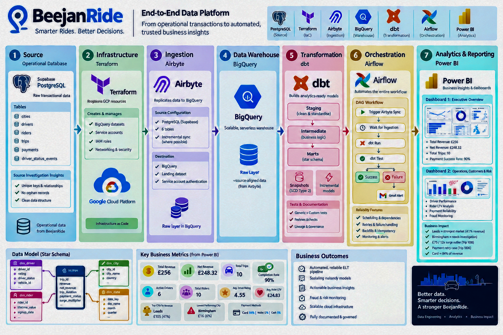
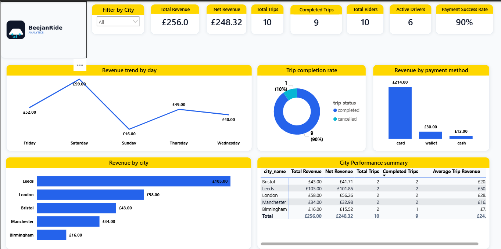
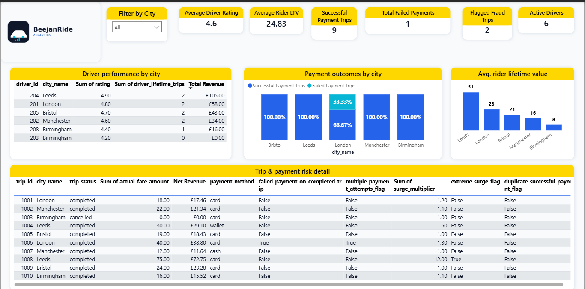

# BeejanRide Analytics

### End-to-End ELT & Business Intelligence Platform

> **From operational transactions to automated, tested, analytics-ready business insights.**


BeejanRide is a UK mobility platform operating across five cities, providing ride-hailing, airport transfers, and scheduled corporate rides.

This project transforms operational PostgreSQL data into a governed, analytics-ready BigQuery warehouse and automated Power BI reporting platform using **Airbyte, dbt, Apache Airflow, Terraform, BigQuery, and Power BI**.

The platform is designed to demonstrate how modern data engineering practices can turn raw transactional data into reliable business intelligence through automated ingestion, dimensional transformation, data quality validation, orchestration, and reporting.

---

## Business Problem

BeejanRide's operational database contains data about trips, riders, drivers, payments, and cities. While this supports day-to-day operations, the transactional structure is not designed for scalable business analytics.

The platform therefore needed a reliable way to:

- Ingest operational data into an analytical warehouse
- Transform raw data into business-ready models
- Apply consistent business logic
- Validate data quality
- Automate the ELT workflow
- Deliver actionable business insights

The resulting platform supports analysis across:

**Revenue · Driver Performance · Rider Value · Payments · Surge Pricing · Risk Monitoring**

---

## Architecture



The completed platform follows a modern ELT architecture.

---

## Data Flow
#### 1. Source

Operational data originates from a PostgreSQL database hosted in Supabase.

The source contains:
- cities
- drivers
- riders
- trips
- payments
- driver_status_events

Initial source investigation was performed to understand:
- Table relationships
- Primary keys
- Data types
- Nullability
- Referential integrity
- Payment and trip relationships
- Potential business anomalies


#### 2. Infrastructure

Terraform is used to provision the required Google Cloud resources and maintain the infrastructure as code.

#### 3. Data Ingestion

**Airbyte Cloud** replicates the required tables from the Supabase PostgreSQL
source into the BigQuery `beejanride_raw` dataset.

Selected streams:

- `cities_raw`
- `drivers_raw`
- `driver_status_events_raw`
- `riders_raw`
- `trips_raw`
- `payments_raw`

The connection runs on a daily schedule, with Airbyte responsible only for
source replication. Transformations are handled separately by dbt.

Airbyte uses a dedicated GCP service account with:

- `roles/bigquery.jobUser` at project level
- `roles/bigquery.dataEditor` on the `beejanride_raw` dataset

This keeps Airbyte restricted to the RAW layer and prevents it from writing
to the STG, INT, or MARTS datasets.

#### 4. Transformation

dbt transforms the RAW data through three analytical layers:
```
RAW
 │
 ▼
STAGING
 │
 ▼
INTERMEDIATE
 │
 ▼
MARTS
```

The transformation layer includes:
- Data standardisation
- Business logic
- Revenue calculations
- Trip duration
- Rider lifetime value
- Driver lifetime activity
- Payment indicators
- Risk indicators
- Incremental models
- SCD Type 2 snapshots
- Data quality tests
- Documentation and lineage

#### 5. Orchestration

Apache Airflow automates the complete workflow:
```
Trigger Airbyte Sync
        ↓
     dbt Run
        ↓
    dbt Test
        ↓
      Success
```
Failures are handled through retry logic and Gmail failure notifications.

The DAG also supports operational requirements such as:

Scheduling
Dependencies
Retries
Backfills
Idempotent execution
Failure handling
Monitoring

Detailed implementation:
airflow-project.md

#### 6. Analytics

The final dbt marts are consumed by Power BI.

The report contains two dashboards:

Executive Overview
Provides a high-level view of revenue, trips, riders, drivers, payment performance, and city performance.

Operations, Customers & Risk
Provides deeper analysis of driver performance, rider lifetime value, payment reliability, and potential risk indicators.

---

## Data Model

The analytical warehouse uses a star schema centred around the trip fact table.
```
                 dim_driver
                     │
                     │
dim_date ─────── fct_trips ─────── dim_rider
                     │
                     │
                 dim_city
```
Fact

fct_trips

Contains trip-level measures and analytical indicators such as:

Revenue
```Net revenue
Trip duration
Payment information
Surge information
Risk indicators
```
Dimensions
```
dim_driver
dim_rider
dim_city
dim_date
```

This structure provides a simple analytical model for Power BI and downstream SQL analysis.

---

## Data Quality & Reliability

Data quality was incorporated throughout the pipeline rather than treated as a final manual check.

The project includes:

Source freshness validation
Primary key tests
Relationship validation
Generic dbt tests
Custom business-rule tests
Incremental model validation
Airflow DAG structural tests

Examples of custom business rules include:
```
trip_duration_positive
no_negative_revenue
completed_trip_successful_payment
```

The source investigation also found the operational dataset to be structurally clean, while unusual records such as payment retries and extreme surge were preserved as potential business signals rather than simply treated as bad data.

--- 

## Design Decisions
#### Layered dbt Architecture

RAW, STAGING, INTERMEDIATE, and MARTS layers separate source data from business logic and final analytical models.

#### Star Schema

A dimensional model was selected to make analytical queries and Power BI reporting simpler and more intuitive.

#### Incremental Processing

The trip fact model uses incremental processing to avoid unnecessarily rebuilding unchanged data.

#### SCD Type 2

A dbt snapshot was implemented for the driver model to track changes to
`driver_status`, `vehicle_id`, and `rating`.

Because the source dataset does not contain historical driver states,
the initial snapshot captures the current state of the drivers. The SCD
Type 2 structure is therefore in place to preserve future changes as
new source states become available.

#### Automated Testing

Data quality checks run as part of the transformation workflow so that invalid data can be detected before reaching the reporting layer.

#### Airflow Orchestration

Airflow provides a single workflow for ingestion, transformation, testing, and failure handling rather than relying on manual execution.

---

## Tradeoffs

#### ELT Instead of ETL

Transformation occurs after loading into BigQuery.

This keeps the ingestion layer close to the source and allows transformation logic to be developed and tested independently.

#### BigQuery Instead of a Local Warehouse

BigQuery provides a scalable analytical environment without requiring management of warehouse infrastructure.

The tradeoff is dependence on a cloud platform and associated usage costs.

#### Small Analytical Dataset

The current dataset is intentionally small, which makes the project easier to demonstrate and validate but limits the statistical strength of the business conclusions.

##### Risk Indicators vs Definitive Fraud

The project identifies potential risk signals such as:

Extreme surge
Multiple payment attempts
Duplicate successful payments
Failed payment on completed trips
These are treated as investigation signals, not proof of fraud.

---

## Power BI Results

The current sample contains 10 trips, generating:
```
| Metric                  |  Result |
| ----------------------- | ------: |
| Total Revenue           |    £256 |
| Net Revenue             | £248.32 |
| Total Trips             |      10 |
| Completed Trips         |       9 |
| Payment Attempt Success |     90% |
| Active Drivers          |       6 |
```
### Key Findings

Leeds is the strongest current market, generating approximately £105 (41%) of total revenue.

Birmingham is currently the weakest market, generating approximately £16, with only 1 of 2 trips completed.

A Leeds trip generated the highest fare at £75, alongside an unusually high 12× surge multiplier, making it a notable pricing outlier.

One completed trip experienced a failed payment followed by a successful retry, demonstrating why payment-attempt performance needs additional context.

Card payments generated approximately 84% of total revenue in the current sample.

These findings are directional because the current dataset contains only 10 trips.

### Power BI Dashboards

#### Executive Overview

The Executive Overview brings together the core business performance indicators across revenue, trips, cities, payment methods, riders, and drivers.



#### Operations & Risk

The second dashboard combines driver performance, rider value, payment reliability, and risk monitoring into a single operational view.



---

## dbt Lineage

The dbt lineage graph demonstrates how source data flows through the transformation layers into the final analytical models.

Detailed dbt implementation:

dbt-project.md

---

## Sample Analytical Queries

The repository includes SQL queries demonstrating how the analytical models can be used to answer business questions.

Examples include:

- Revenue by city
- Top drivers by revenue
- Rider lifetime value
- Payment reliability
- Surge impact
- Potential risk/fraud indicators

See:
[dbt/analyses/business_queries.sql](dbt/analyses/business_queries.sql)

---

## Future Improvements

With a larger production dataset, the platform could be extended with:
- Driver churn analysis
- Rider retention and cohort analysis
- More advanced surge-demand analysis
- City-level profitability analysis
- Statistical anomaly detection
- Expanded data quality monitoring
- Operational SLA monitoring
- More advanced fraud detection
- BigQuery partitioning and clustering optimisation

Operating costs would also enable the platform to move beyond revenue analysis into true profitability analysis.

---

## Project Documentation

| Component | Documentation                                |
| --------- | -------------------------------------------- |
| dbt       | [`dbt/README.md`](dbt/README.md)             |
| Airflow   | [`airflow/README.md`](airflow/README.md)     |
| Terraform | [`terraform/README.md`](terraform/README.md) |
---