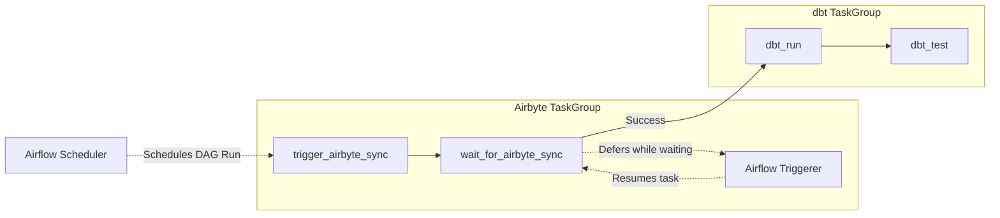
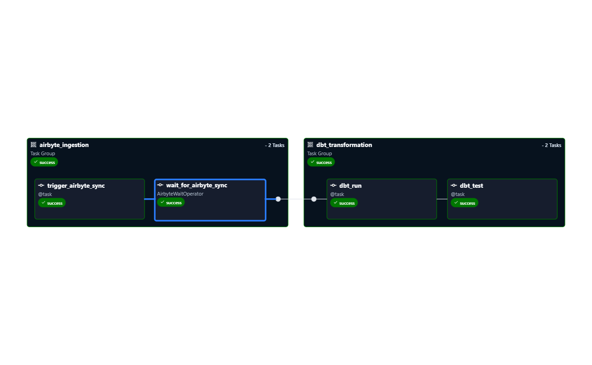
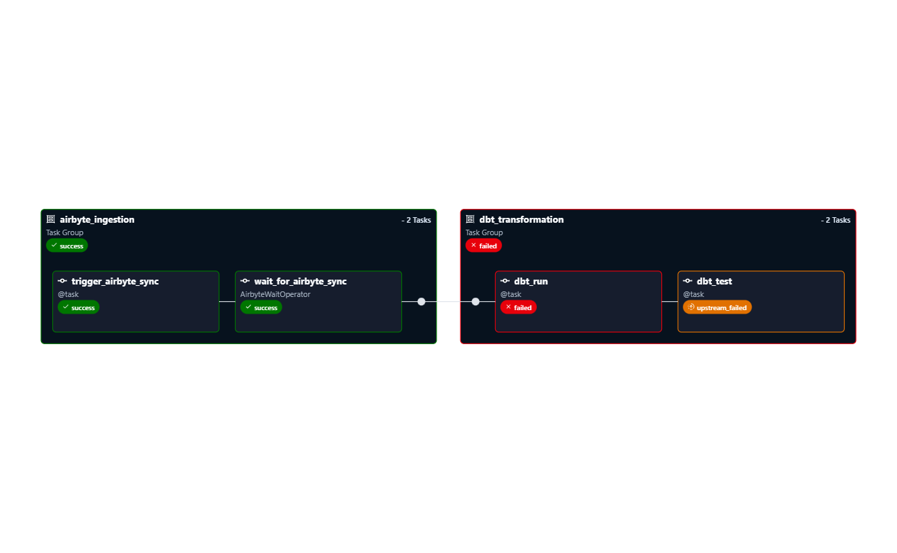
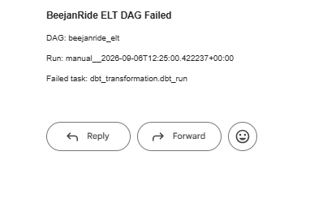
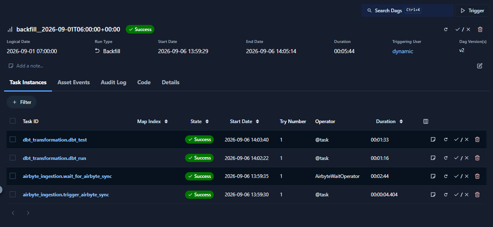
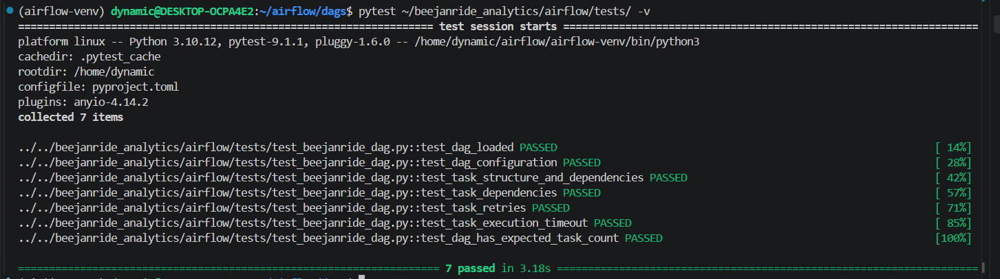

# Apache Airflow ELT Orchestration

Apache Airflow orchestration layer for the BeejanRide analytics platform.

This phase connects the existing **Airbyte ingestion** and **dbt transformation** layers into a single scheduled and monitored ELT workflow.

---

## Overview

The BeejanRide platform uses:

- **PostgreSQL** as the operational source
- **Airbyte Cloud** for incremental data ingestion
- **BigQuery** as the analytical warehouse
- **dbt** for transformation and data quality
- **Apache Airflow** for orchestration
- **Power BI** for analytics and reporting

Airflow coordinates the pipeline so that ingestion completes before transformation, and transformation completes before data quality testing.

```text
PostgreSQL
    │
    ▼
Airbyte Cloud
    │
    ▼
BigQuery Raw
    │
    ▼
┌──────────────────────────────┐
│       Apache Airflow         │
│                              │
│  airbyte_ingestion           │
│   ├─ trigger_airbyte_sync    │
│   └─ wait_for_airbyte_sync   │
│              │               │
│              ▼               │
│  dbt_transformation          │
│   ├─ dbt_run                 │
│   └─ dbt_test                │
└──────────────┬───────────────┘
               │
               ▼
      BigQuery Analytics
               │
               ▼
           Power BI

      └── Failure → Gmail
```

---

## Airflow Environment
Airflow was installed through PyPI in a dedicated virtual environment rather than Docker.

| Component     | Configuration      |
| ------------- | ------------------ |
| Airflow       | 3.3.1              |
| Python        | 3.10.12            |
| Executor      | LocalExecutor      |
| Deployment    | Airflow Standalone |
| OS            | WSL2 / Ubuntu      |
| Metadata DB   | SQLite             |
| Scheduler     | Enabled            |
| DAG Processor | Enabled            |
| Triggerer     | Enabled            |
| UI            | `localhost:8080`   |

This lightweight setup was chosen for local development and portfolio demonstration because running the full containerized Airflow stack was unnecessarily resource-intensive for the available development environment.

It is a *local development deployment*, not a highly available production Airflow environment.

For larger deployments, the Airflow best-practices guidance recommends stronger infrastructure such as PostgreSQL for the metadata database and horizontally scalable Airflow components.

---

## DAG Design

The main DAG is:

```beejanride_elt```

The DAG uses TaskGroups to separate ingestion from transformation:


This ensures dbt cannot start until the Airbyte synchronization has successfully completed.

TaskGroups were used to provide a clear visual hierarchy in the Airflow UI, following the recommended approach for organizing related tasks in larger workflows.

---

## Scheduling

The DAG runs daily:

```schedule="0 6 * * *"```

Additional scheduling controls:
```
catchup=False
max_active_runs=1
```

```catchup=False```

Prevents Airflow from automatically creating historical DAG runs when the scheduler starts.

Historical processing can instead be triggered intentionally through Airflow backfills.

```max_active_runs=1```

Prevents overlapping executions of the same DAG.

This reduces the risk of concurrent runs modifying the same warehouse state at the same time.

---

## Airbyte Integration

Airflow communicates with Airbyte Cloud through the Airbyte API.
The Airbyte connection UUID identifies the remote Airbyte pipeline:

`xxxxxx-xxxx-xxxx-xxxxx-xxxxxxxx`

The DAG does not contain the Airbyte API secret.
Instead, the credentials are stored in an Airflow Connection:

`airbyte_cloud`

The workflow is:

```text
Airflow
   │
   ├── authenticate with Airbyte Cloud
   │
   ├── submit synchronization
   │
   └── receive jobId
            │
            ▼
      Airbyte Cloud Job
```
The jobId returned by Airbyte is passed dynamically to the downstream waiting task rather than being hard-coded.

---

## Deferrable Airbyte Monitoring

Airbyte synchronization is an external asynchronous process.

Instead of keeping an Airflow task actively running while waiting for Airbyte to finish, the project uses:
* `AirbyteJobTrigger`
* `AirbyteWaitOperator`

The workflow is:

```text
Start Airbyte Sync
       ↓
Receive jobId
       ↓
AirbyteWaitOperator
       ↓
Airflow Triggerer
       ↓
Poll Airbyte status
       ↓
Job succeeds
       ↓
Task resumes
       ↓
dbt starts
```
This follows the Airflow best-practice recommendation to use deferrable operators when tasks spend significant time waiting on external systems. Deferral releases the worker execution slot while the Triggerer handles the wait.

This is preferable to implementing a blocking loop such as:
```
while True:
    time.sleep(30)
```
because the latter unnecessarily occupies a worker while no useful computation is occurring.

---

### dbt Integration

Airflow executes the existing BeejanRide dbt project rather than duplicating the dbt environment inside Airflow.

The DAG uses:
* `DBT_PROJECT_DIR`: `/home/dynamic/beejanride_analytics/dbt`
* `DBT_EXECUTABLE`: `/home/dynamic/beejanride_analytics/.venv/bin/dbt`

Airflow executes:
```bash
dbt run
```
followed by:

```bash
dbt test
```
The existing dbt transformation architecture is:
```
Plaintext
Raw
 ↓
Staging
 ↓
Intermediate
 ↓
Marts
```
This keeps the Airflow orchestration layer separate from the dbt transformation logic.

Airflow is responsible for when and in what order the transformations execute, while dbt remains responsible for how the data is transformed and validated.

---

## Data Quality

The dbt transformation stage is explicitly dependent on successful ingestion:
```
Airbyte
   ↓
dbt run
   ↓
dbt test
```
The dependency:

```run_dbt >> test_dbt```

ensures that tests only execute after a successful transformation.

If dbt_run fails:
```
dbt_run
   ↓
FAILED

dbt_test
   ↓
UPSTREAM_FAILED
```
This prevents a failed transformation from being incorrectly followed by a successful data quality stage.

The dbt project already contains structural, relationship, accepted-value, null, and custom business-rule tests.

---

## Failure Handling and Resilience

The DAG applies common retry and timeout controls:
```
retries=2
retry_delay=timedelta(minutes=5)
execution_timeout=timedelta(minutes=30)
```
The expected behaviour is:
```
Task fails
   ↓
Retry
   ↓
Retry
   ↓
Still failing
   ↓
Task marked FAILED
   ↓
Failure notification
```
Retries provide protection against transient failures, while the execution timeout prevents a task from remaining active indefinitely.

API requests also use explicit timeouts and HTTP responses are validated using:

```response.raise_for_status()```

Airbyte job completion is explicitly validated before allowing downstream processing to continue.

---

## Failure Alerting

Airflow's native SMTP notification mechanism is used for task failure alerts.

The SMTP credentials are stored in:

```smtp_gmail```

rather than inside the DAG source code.

A failure callback sends an email containing execution metadata such as:

- DAG ID
- Run ID
- Failed task ID

The notification flow is:
```
Task Failure
     ↓
Retries Exhausted
     ↓
Failure Callback
     ↓
Gmail SMTP
     ↓
Engineering Alert
```
This follows the best-practice recommendation to use Airflow's built-in notifications, callbacks, and notifiers for workflow alerting.

---

## Idempotency

Idempotency is maintained across the data platform rather than relying on Airflow alone.

#### Airbyte

Airbyte uses stateful incremental synchronization so that new or updated source records can be processed without repeatedly reloading the entire dataset.

#### dbt

The incremental fct_trips model uses:

```trip_id```

as its unique business key.

BigQuery merge/upsert behaviour allows existing records to be updated rather than blindly appended.

Therefore, repeated processing does not create duplicate trip records.

#### Airflow

Airflow contributes through:

```max_active_runs=1```

which prevents overlapping executions of the same DAG.

Explicit task dependencies also ensure that transformation only begins after ingestion has completed successfully.

Therefore:
```
Airbyte
Record-level ingestion behaviour
        +
dbt
Record-level transformation behaviour
        +
Airflow
Execution ordering and concurrency control
```
provide the overall idempotent pipeline design.

---

## Historical Backfills

The DAG uses:

```catchup=False```

to prevent automatic creation of historical runs.

When historical processing is required, Airflow's backfill functionality can be used explicitly:

```airflow backfill create```

This provides controlled historical processing without enabling automatic catchup.

A historical backfill was successfully executed and validated during testing.

---

## Testing

The Airflow implementation includes DAG validation tests using pytest and Airflow's DagBag.

The tests verify:

- DAG loads successfully
- No DAG import errors exist
- max_active_runs=1
- catchup=False
- Required tasks exist
- Task retry configuration is present

The test suite follows the Airflow best-practice recommendation to validate DAG imports and important DAG configuration, while also providing tests for custom DAG logic.

Run the tests with:

```pytest```

---

## Operational Validation

The implementation was tested through the following scenarios.

#### 1. Successful ELT Run
```
Airbyte Sync       ✓
Airbyte Monitoring ✓
dbt Run            ✓
dbt Test           ✓
```
The complete DAG successfully executed from ingestion through data quality testing.

#### 2. Intentional Failure

The dbt executable path was intentionally invalidated to simulate a transformation failure.

Expected behaviour was observed:
```
Airbyte Sync       ✓
Airbyte Monitoring ✓
dbt Run            ✗
dbt Test           ↑
                    UPSTREAM_FAILED
```
The failure also triggered the configured Gmail notification.

#### 3. Backfill

A historical backfill was executed successfully to verify that the DAG can process an explicitly selected historical interval.

#### 4. DAG Validation

The pytest suite successfully validated DAG loading, configuration, task structure, and retry requirements.

---

## Evidence

#### Successful DAG Run

The successful run demonstrates the complete:

```Airbyte → dbt run → dbt test```

workflow.


#### Failed DAG Run

The intentionally failed run demonstrates that downstream tasks are prevented from executing after a critical transformation failure.


#### Gmail Failure Alert

The failure callback successfully delivered an automated notification containing task execution metadata.


#### Backfill

The successful backfill demonstrates controlled historical processing with ```catchup=False.```


#### DAG Validation Tests

The pytest results provide automated validation of the Airflow DAG structure and configuration.

---

## Best Practices Applied

The implementation applies the following Airflow practices:
| Practice                       | Implementation                                     |
| ------------------------------ | -------------------------------------------------- |
| Task Groups                    | `airbyte_ingestion`, `dbt_transformation`          |
| Deferrable execution           | Custom `AirbyteJobTrigger` + `AirbyteWaitOperator` |
| Avoid top-level external calls | API requests execute inside tasks                  |
| Retries                        | 2 retries with 5-minute delay                      |
| Timeouts                       | 30-minute execution timeout                        |
| Explicit dependencies          | Airbyte → dbt run → dbt test                       |
| Failure notifications          | Native SMTP callback                               |
| Secure credentials             | Airflow Connections                                |
| Concurrency control            | `max_active_runs=1`                                |
| Controlled history             | `catchup=False` + explicit backfill                |
| DAG validation                 | pytest + DagBag                                    |
| Monitoring                     | Airflow UI and task logs                           |

These practices are aligned with the uploaded Airflow best-practices guidance, particularly its recommendations around avoiding heavy top-level DAG code, using TaskGroups, deferrable operators, DAG validation, and built-in notifications.

---

## Repository Structure
```
airflow/
├── dags/
│   ├── beejanride_elt.py
│   └── beejanride_airbyte_trigger.py
│
├── tests/
│   └── test_beejanride_elt.py
│
├── README.md
└── ...
```

---

## Key Design Decisions

#### Why Airflow?

Airbyte and dbt each perform important parts of the data pipeline, but neither provides the complete orchestration layer required to coordinate the workflow.

Airflow provides:
```
Scheduling
    +
Dependencies
    +
Retries
    +
Monitoring
    +
Alerting
    +
Backfills
```

#### Why Airbyte Cloud?

Airbyte Cloud was already established as the ingestion platform for the BeejanRide project. Airflow therefore integrates with the existing Airbyte connection instead of introducing another ingestion mechanism.

#### Why LocalExecutor?

The project is a lightweight local portfolio implementation. LocalExecutor provides concurrent task execution without the additional infrastructure required by Celery or Kubernetes.

For larger production environments, executor and infrastructure choices would be revisited based on workload, isolation, scalability, and availability requirements.

#### Why subprocess for dbt?

The dbt project already has its own virtual environment and dependencies.

Calling the existing dbt executable ensures Airflow runs the same environment that was used to develop and validate the dbt project.

---

## Lessons Learned

#### 1. External jobs and Airflow tasks are different

Starting an Airbyte synchronization does not mean the synchronization has completed.

The orchestration therefore separates:
```
START
  ↓
WAIT
  ↓
VERIFY
```
#### 2. Deferral is different from sleeping

A blocking sleep keeps a worker occupied.

Deferral allows Airflow's Triggerer to monitor the external operation while the worker slot is released.

#### 3. Idempotency is a platform concern

Airflow alone does not make a data pipeline idempotent.

Reliable reprocessing requires coordination between:
```
Airbyte ingestion state
        +
dbt incremental model design
        +
Airflow concurrency control
```
#### 4. Failure handling should stop bad data downstream

A failed transformation should not allow data quality testing or downstream consumption to continue as if the pipeline succeeded.

Explicit dependencies make this behaviour predictable.

#### 5. Credentials belong outside DAG source code

Airbyte and SMTP credentials are managed through Airflow Connections rather than hard-coded in Python.

---