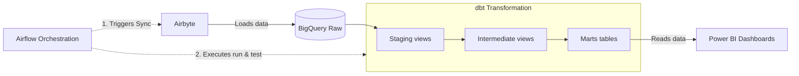
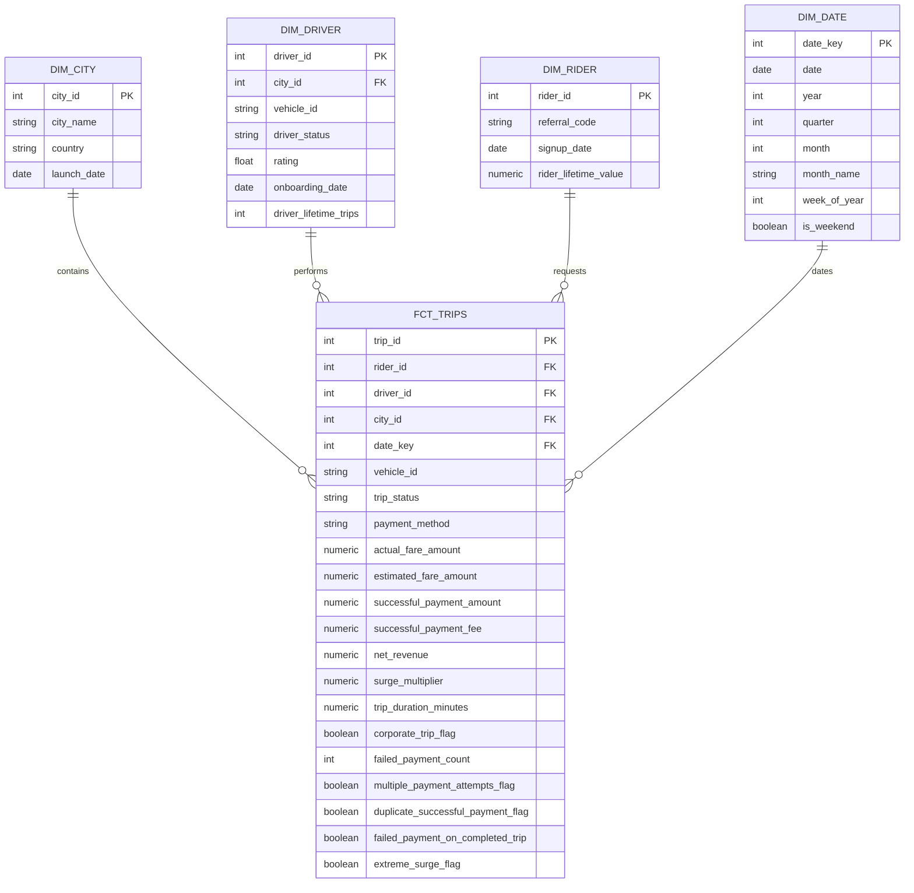
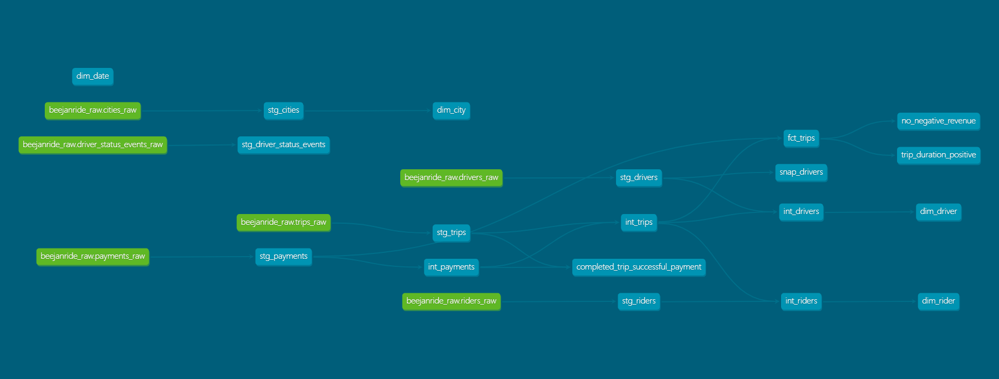

# BeejanRide Analytics — dbt Transformation Layer

The dbt transformation layer for **BeejanRide Analytics** transforms raw transactional data into a tested, documented, and analytics-ready BigQuery warehouse.

The project follows a layered transformation approach:

**Raw → Staging → Intermediate → Marts → BI / Analytics**

dbt is responsible for data transformation, testing, documentation, incremental processing, snapshots, and analytical modeling. Airbyte handles ingestion from PostgreSQL into BigQuery, while Terraform provisions the underlying BigQuery infrastructure.

---

## Architecture



### Data Flow

1. **BigQuery Raw** contains the data replicated from the operational PostgreSQL source by Airbyte.
2. **Airflow** orchestrates the dbt workflow by triggering dbt after successful ingestion and running the dbt test suite after transformation.
3. **Staging models** standardize raw data types, naming, timestamps, and keys.
4. **Intermediate models** apply reusable business logic and transform data into the appropriate analytical grain.
5. **Marts** expose the final analytics-ready star schema.
6. **dbt tests** validate model integrity and business rules before the transformed data is consumed by downstream analytics.
7. **Power BI and analytical queries** consume the curated mart models.

## Data Modeling

The dbt project is organized into four main transformation layers.
```
models/
├── staging/
├── intermediate/
├── marts/
└── docs/
```
### Staging Layer

The staging layer provides a clean representation of the raw source data.

Responsibilities include:

- Standardizing column names
- Casting data types
- Normalizing timestamps
- Establishing consistent keys
- Removing source-level inconsistencies
- Applying basic source-level tests
- Keeping business logic out of the initial transformation layer

Staging models are intentionally lightweight so that downstream models can build on a consistent source interface.

### Intermediate Layer

The intermediate layer contains reusable business logic between source preparation and the final analytical marts.

Key transformations include:

- Aggregating payment records to the trip grain
- Calculating trip duration
- Calculating net revenue
- Classifying corporate and personal trips
- Calculating rider lifetime value
- Calculating driver lifetime completed trips
- Creating payment reliability indicators
- Creating fraud detection indicators

A key modeling decision is to aggregate payment activity to one row per trip before joining it to the trip data.

This prevents payment records from creating a one-to-many join against trips and avoids artificially inflating trip counts and financial metrics.

### Marts Layer

The marts layer provides the final analytics-ready star schema.

#### Fact Table

fct_trips

```Grain: one row per unique trip```

The fact table contains:

- Trip identifiers
- Rider, driver, city and date keys
- Trip status
- Vehicle information
- Fare and payment metrics
- Net revenue
- Surge metrics
- Trip duration
- Corporate trip classification
- Payment failure indicators
- Fraud indicators
- Operational timestamps

#### Dimension Tables

| Model        | Purpose                                 |
| ------------ | --------------------------------------- |
| `dim_city`   | City and market attributes              |
| `dim_driver` | Driver attributes and lifetime activity |
| `dim_rider`  | Rider attributes and lifetime value     |
| `dim_date`   | Calendar and time-series analysis       |


#### Entity Relationship Diagram (Star Schema)



##### Business Analytics
The warehouse is designed to support the following business objectives: 

| Business Objective            | Primary Model / Metric                                               |
| ----------------------------- | -------------------------------------------------------------------- |
| Daily revenue per city        | `fct_trips` + `dim_city` + `dim_date`                                |
| Gross vs net revenue          | `successful_payment_amount`, `successful_payment_fee`, `net_revenue` |
| Corporate vs personal revenue | `corporate_trip_flag`                                                |
| Top drivers by revenue        | `fct_trips` + `dim_driver`                                           |
| Driver activity monitoring    | `dim_driver`                                                         |
| Rider lifetime value          | `dim_rider`                                                          |
| Payment failure rate          | Payment metrics                                                      |
| Surge impact analysis         | `surge_multiplier`                                                   |
| Driver churn tracking         | `snap_drivers`                                                       |
| Fraud detection               | Fraud indicator flags                                                |

These models support:

- Daily revenue reporting
- City-level revenue and net revenue performance
- Driver leaderboard analysis
- Rider lifetime value analysis
- Payment reliability monitoring
- Fraud monitoring

```Note: Net revenue is not the same as accounting profit. True city profitability would require additional operating-cost data such as driver costs, fuel, and city-level operating expenses etc.```

#### Key Metrics
*   **Metrics**: Centralized business definitions are maintained in [models/docs/metrics.md](models/docs/metrics.md) to ensure documentation consistency across the pipeline.

| Metric                    | Definition                                                       |
| ------------------------- | ---------------------------------------------------------------- |
| **Net Revenue**           | Successful payment amount minus successful payment fee           |
| **Trip Duration**         | Elapsed time between pickup and drop-off, measured in minutes    |
| **Corporate Trip**        | Trip classified as business/corporate rather than personal       |
| **Rider LTV**             | Cumulative net revenue generated by a rider from completed trips |
| **Driver Lifetime Trips** | Total completed trips attributed to a driver                     |
| **Payment Failure Rate**  | Failed payment attempts divided by total payment attempts        |


## Data Quality & Governance

Data quality is treated as part of the transformation pipeline rather than as a separate downstream activity.

### Testing
The project uses dbt's built-in tests together with custom SQL tests. 
Examples include:
* `not_null`
* `unique`
* Relationship tests between fact and dimension tables
* Positive trip duration validation
* Prevention of negative revenue
* Validation that completed trips have successful payments

The completed dbt test suite contains 88 data tests.

### Source Freshness
Source freshness monitoring is configured for the transactional source data so that stale ingestion can be detected before it affects downstream reporting.

### Governance Metadata
Models are classified using dbt metadata:

```yaml
meta:
  owner: finance
```
and domain tags such as:

```yaml
tags:
  - finance
  - operations
  - fraud
```
This provides lightweight ownership and domain classification without adding unnecessary governance complexity.

## Incremental Processing

### Why Incremental Processing?
fct_trips is implemented as an incremental model because it represents an accumulating trip-level fact table.
As the number of trips grows, rebuilding the complete historical fact table for every pipeline run would:
* Process data that has not changed
* Increase BigQuery query cost
* Increase transformation time
* Reduce pipeline efficiency

Incremental processing allows dbt to process new and recently changed records while retaining existing historical data.

### Incremental Strategy
The fact table uses:
* Incremental materialization
* trip_id as the unique key
* BigQuery MERGE behavior through dbt
* A 24-hour lookback window

The lookback is important because a trip can be affected by payment activity that arrives or changes after the original trip record.
Therefore, the incremental logic does not rely solely on the trip's own update timestamp.
This provides a balance between processing efficiency and protection against late-arriving changes.

### Full Refresh vs Incremental

| Approach         | Advantages                                      | Tradeoffs                                                           |
| ---------------- | ----------------------------------------------- | ------------------------------------------------------------------- |
| **Full refresh** | Simple, reliable rebuild of all historical data | More expensive and slower as data grows                             |
| **Incremental**  | Faster runs and lower recurring compute         | More complex and requires careful handling of late-arriving changes |

A full refresh remains useful when:

- Historical logic changes
- Existing records require complete reconstruction
- Data corrections affect a large portion of history
- The incremental strategy itself needs to be rebuilt

Incremental processing is therefore used where it provides clear value, rather than forcing every dbt model to be incremental.

### SCD Type 2 Driver History

The project uses a dbt snapshot to preserve changes to driver attributes over time.

The snapshot tracks changes to:
* driver_status
* vehicle_id
* rating

The snapshot uses a check strategy to create historical versions when these tracked attributes change.

### Important Source Limitation

The source driver table contains the driver's current state rather than historical versions.

Therefore, the initial snapshot represents the driver's initial observed state. It cannot reconstruct changes that occurred before the snapshot was introduced.

The snapshot is consequently future-ready rather than a reconstruction of historical driver changes.

This distinction prevents the warehouse from presenting fabricated historical churn information.

The snapshot can support future analyses such as:
* Driver status changes
* Vehicle changes
* Rating changes
* Driver retention and churn monitoring once multiple historical versions exist

## Key Design Decisions & Tradeoffs

#### 1. Star Schema
A dimensional star schema was selected for the mart layer because the primary consumers are analytical queries and BI dashboards.

It provides:
* Clear business entities
* Predictable fact grain
* Simpler analytical queries
* Reusable dimensions
* Efficient BI modeling

#### 2. Trip-Level Fact Grain
`fct_trips` is maintained at one row per unique trip.

This provides a stable analytical grain for:
* Revenue analysis
* Trip counts
* Driver performance
* Rider behavior
* City performance
* Payment monitoring
* Fraud analysis

#### 3. Payment Aggregation Before Joining
Payment records can contain multiple attempts for the same trip.

Joining raw payment records directly to trips would create multiple rows per trip and could inflate financial and operational metrics.

Payment activity is therefore aggregated to trip grain in `int_payments` before being incorporated into `int_trips` and `fct_trips`.

#### 4. Vehicle ID as a String
Vehicle identifiers such as `VH001` are stored as strings.

Although the identifier contains numbers, it represents an identifier rather than a numeric measure.

Treating it as a numeric field would be semantically incorrect and would not support identifiers containing alphabetic characters.

#### 5. Views vs Tables
Transformation layers are materialized according to their purpose.

Lightweight staging and reusable intermediate transformations can remain views where appropriate, while the final marts provide persistent analytical tables.

This avoids materializing every transformation unnecessarily while keeping the final reporting layer stable.

#### 6. Incremental Fact Table
The accumulating trip fact is incremental because rebuilding the complete history on every run becomes inefficient as data volume increases.

The tradeoff is additional logic for handling updates and late-arriving payment activity.

#### 7. Driver Snapshot
A snapshot is used for driver attribute history rather than attempting to derive SCD Type 2 history from driver status event records.

Driver status events represent operational events such as online/offline activity, whereas the snapshot is intended to preserve changes to driver attributes.

Because the source does not contain prior versions, the snapshot is designed to capture changes going forward.

## Validation

The dbt project has been validated using:
* `dbt parse`
* `dbt test`
* `git diff --check`

The project successfully:
* Parses without dbt compilation errors
* Passes the implemented data test suite
* Maintains valid model and test configuration
* Passes whitespace and patch validation

The dbt documentation site has also been generated successfully using:

```bash
dbt docs generate
```
and can be served locally with:

```bash
dbt docs serve
```
The generated documentation provides model descriptions, column definitions, tests, dependencies, and lineage.

## dbt Lineage

The dbt documentation interface provides the complete transformation lineage from source data through staging and intermediate models into the final marts.

**Lineage screenshot:**  


## Analytical Queries

Sample SQL demonstrating the business questions supported by the warehouse is available in:

[analyses/business_queries.sql](analyses/business_queries.sql)

The queries cover:
* Daily revenue by city
* Gross vs net revenue
* Corporate vs personal revenue
* Top drivers by revenue
* Driver activity monitoring
* Rider lifetime value
* Payment failure rate
* Surge impact analysis
* Fraud detection
* Driver churn / SCD Type 2 monitoring

These queries are provided as analytical examples rather than additional dbt models.

## Project Structure

```text
dbt/
├── analyses/
│   └── business_queries.sql
│
├── models/
│   ├── staging/
│   │   ├── schema.yml
│   │   └── ...
│   │
│   ├── intermediate/
│   │   ├── schema.yml
│   │   └── ...
│   │
│   ├── marts/
│   │   ├── schema.yml
│   │   └── ...
│   │
│   └── docs/
│       └── metrics.md
│
├── snapshots/
│   └── snap_drivers.sql
│
├── tests/
│   ├── completed_trip_successful_payment.sql
│   ├── no_negative_revenue.sql
│   └── trip_duration_positive.sql
│
├── dbt_project.yml
└── README.md
```

### Running the Project
From the dbt project directory:

```bash
cd ~/beejanride_analytics/dbt
```
Check the dbt environment:

```bash
dbt debug
```
Run the transformation pipeline:

```bash
dbt run
```
Run the test suite:

```bash
dbt test
```
Run models and tests together:

```bash
dbt build
```
Generate documentation:

```bash
dbt docs generate
```
Serve the documentation locally:

```bash
dbt docs serve
```
**Note: The project requires valid BigQuery authentication and the appropriate dbt profile configuration. Credentials should remain outside version control.**

## Known Limitations

### Historical Driver Changes
The source driver table does not contain historical versions. The SCD Type 2 snapshot therefore cannot reconstruct changes that occurred before snapshotting began.

### True Profitability
The current warehouse provides gross and net revenue analysis, but not complete accounting profitability because operating-cost data is not available.

### Source-Level Historical Corrections
Incremental processing improves efficiency but requires a full refresh when changes affect historical records outside the incremental lookback strategy.

## Future Improvements

Potential improvements include:
* Add operating-cost data for true city profitability analysis
* Expand historical driver tracking as more snapshot versions accumulate
* Introduce automated CI validation for dbt changes
* Add stronger pipeline observability and alerting
* Upgrade the project runtime to a newer supported Python version
* Expand analytical models as new business requirements emerge

